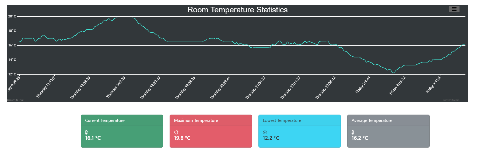
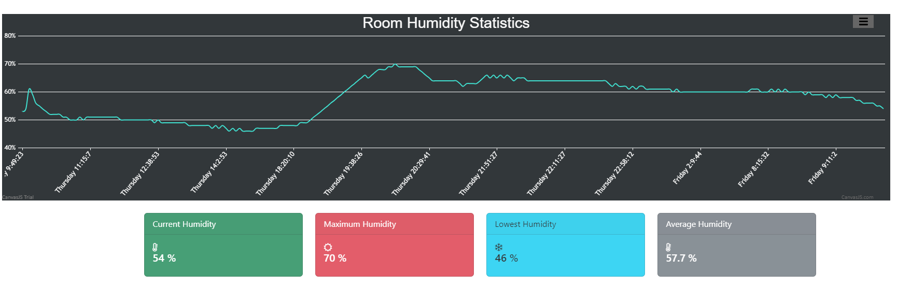

# RoomTempHumReader
Room Temperature and Humidity Reader web application to view temperature &amp; humidity in a specific room.

## Tech Stack

- Django - Web Application to see the temperature & humidity data.
- Adruino IDE - Write the code for the microcontroller.
- Firebase - As a cloud-hosted NoSQL database to store the required data.

## Hardware Requirements
- ESP8266 NodeMCU
- DHT11 Sensor
- Internet Connection
 
### Interface Example

